ProjectPortfolio

ProjectPortfolio is a web application developed for the Software Engineering course.

The application helps developers organize software projects by managing use cases and CRC cards while supporting the generation of UML diagrams.

## Live Demo

🌐 **Live Website:** https://projectportfolio.up.railway.app

## Features

### User Management
- User registration
- User login/logout
- Profile management
- Password update

### Project Management
- Create projects
- View project list
- Delete projects

### Use Cases
- Create use cases
- Edit use cases
- Delete use cases
- View use case list

### CRC Cards
- Create CRC cards
- Edit CRC cards
- Delete CRC cards
- Link CRC cards with use cases

### UML Generation
- Generate PlantUML scripts
- Generate Nomnoml scripts
- Generate Use Case diagrams
- Generate Class diagrams

## Technologies

- Java 17
- Spring Boot 3
- Spring Security
- Spring Data JPA
- Thymeleaf
- MySQL
- Gradle
- Railway

## Installation

Clone the repository

```bash
git clone https://github.com/GrigorisVasileiou/ProjectPortfolio.git
```

Configure the database using environment variables:

```
DB_URL
DB_USERNAME
DB_PASSWORD
```

Run the application

```bash
./gradlew bootRun
```

or

```bash
gradlew.bat bootRun
```

The application will be available at

```
http://localhost:8080
```

## Documentation

The complete project report is available in the Report.pdf.

The project report contains:
- Use Case descriptions
- CRC Cards
- UML diagrams
- Project timeline
- Sprint progress and project management details

## How the Application Works

The application provides a workspace where developers can organize their software projects, define use cases, create CRC cards, and visualize the project's design through UML diagrams.

### 1. User Registration and Login

When the application is launched, users are presented with the login page. Users who already have an account can log in using their credentials. If they do not have an account, they can select the registration option to create one.


### 2. Workspace

After a successful login, the user is redirected to their personal workspace. From there, they can view their existing projects, create new projects, or manage their projects.


### 3. User Profile

From the profile page, users can manage their account information. They can update their username, email address, and password.


### 4. Project Management

Users can create new projects and organize their software development work within them. Projects can also be deleted when they are no longer needed.


Here the user can see the project details.

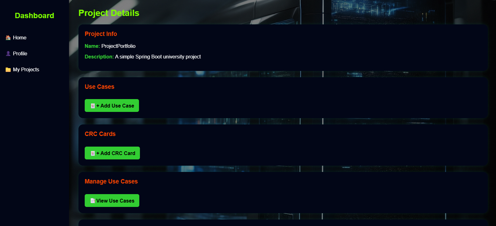
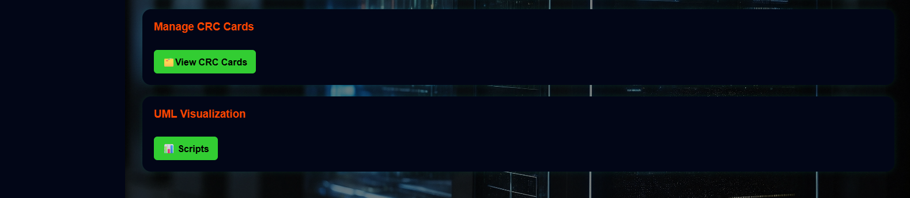

### 5. Use Cases

For each project, users can create and manage use cases by defining the actors, preconditions, main flow, and postconditions. Existing use cases can also be updated or deleted.

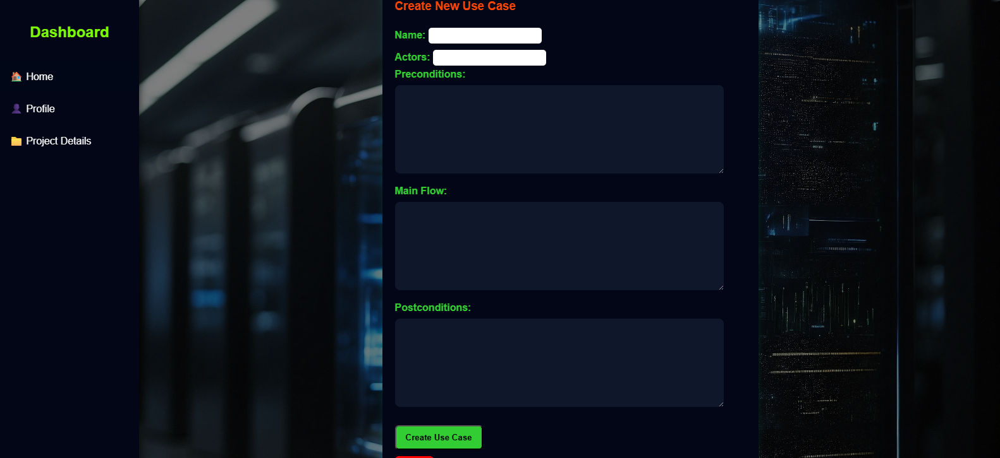
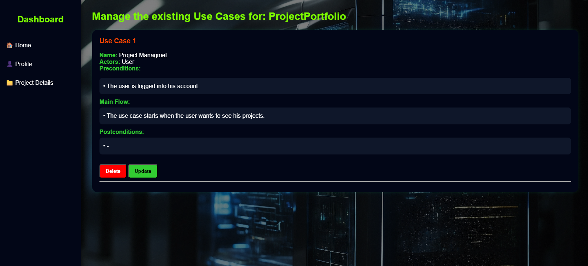

### 6. CRC Cards

Users can create CRC cards by specifying the class name, responsibilities, collaborations and link them with Use Cases if you wants. CRC cards can be updated, deleted, and linked to one or more use cases.

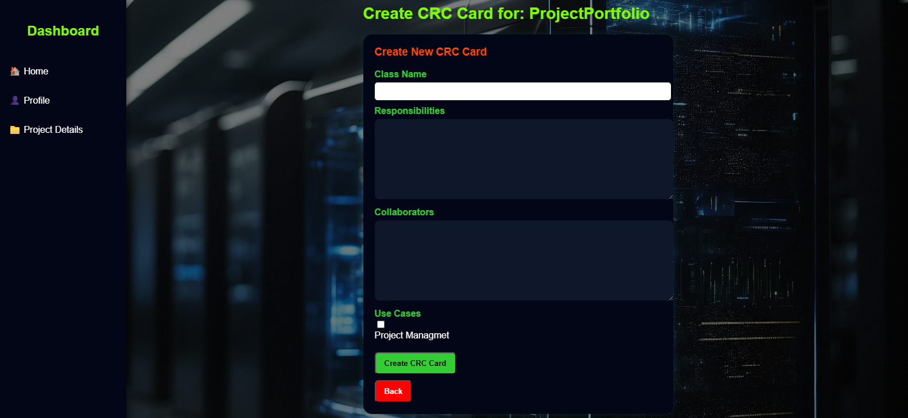
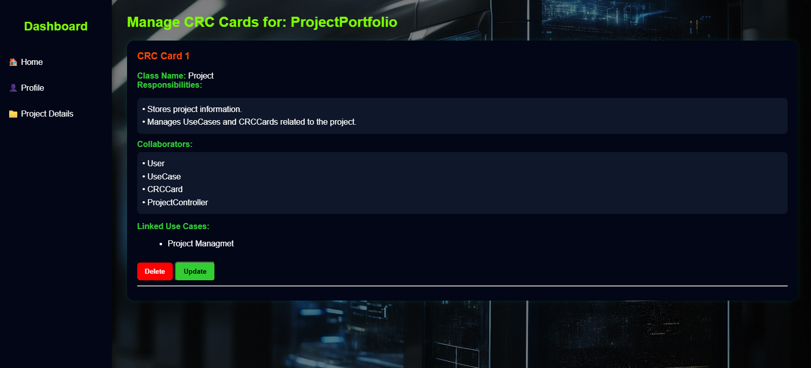

### 7. UML Diagrams

The application can generate scripts for visualizing the project's use cases and CRC cards as UML diagrams using PlantUML.

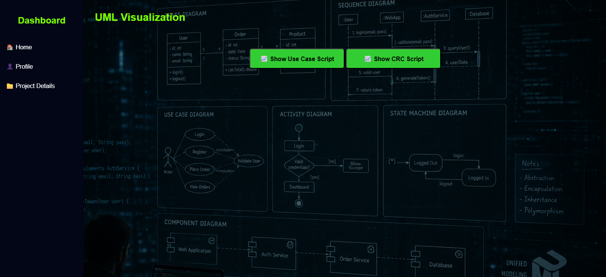

An example for the Use Case Script.
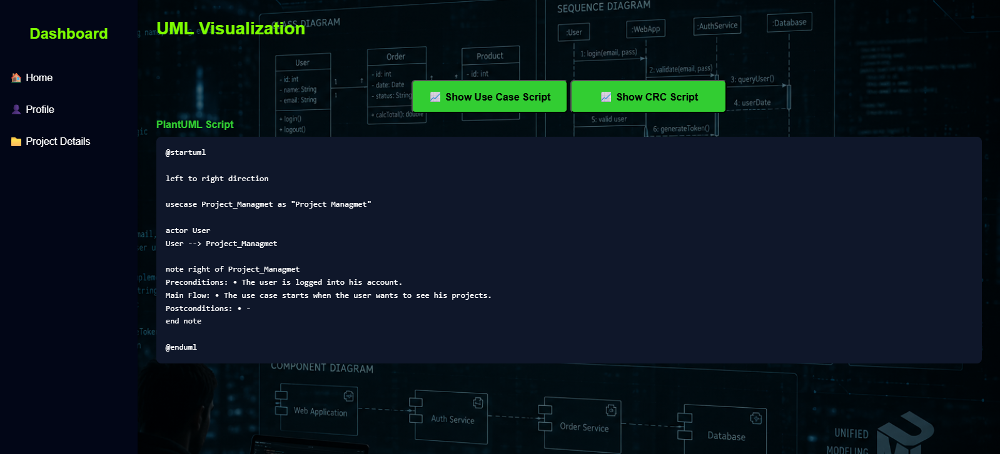

An example for the CRC Card Script.
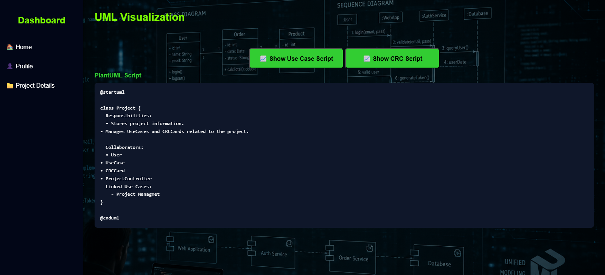

Then the user can copy the scripts and paste them at PlantUML here: https://plantuml.com/

The example of Use Case at PlantUML.
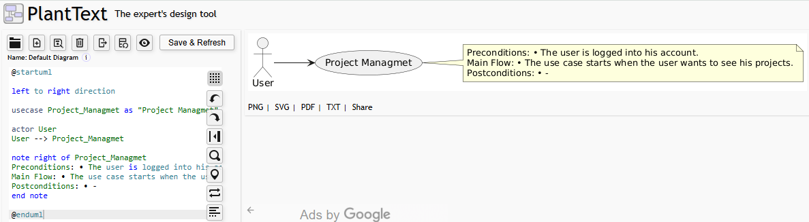

The example of CRC Card at PlantUML.
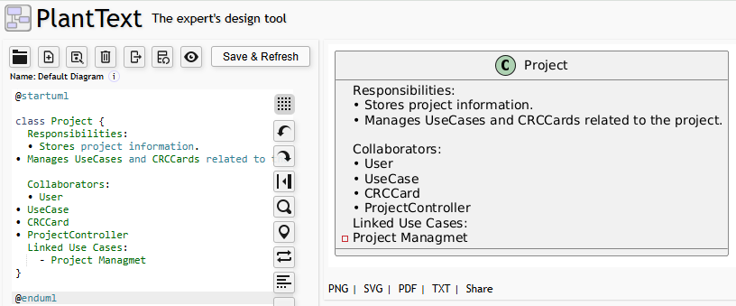

## Author

Grigoris Rafail Vasileiou,
Georgios Papadopoulos -
University of Ioannina -
Software Engineering Course
